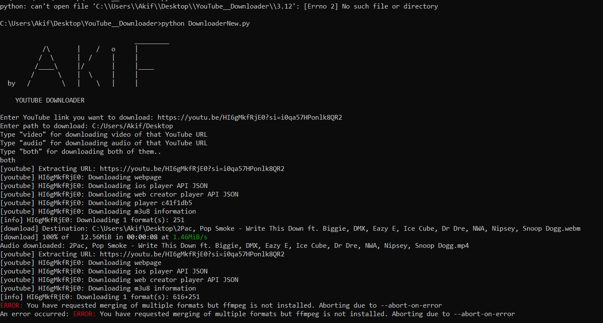

# YouTube_Downloader
Give any YouTube link and get video or audio of that or both of them..

  FOR USING:

1)     pip install pytube
2)     git clone https://github.com/AkifShikhlarov/YouTube_Downloader.git
3)     cd YouTube_Downloader
4)     python YouTubedownloader.py
5)     if you have problem after this You can check another program written below the instructions

   by Akif Shikhlarov

# This Project is for downloading mainly audios from youtube with links.

`For Windows (CMD)`
1)      pip install yt-dlp

2)      git clone https://github.com/AkifShikhlarov/YouTube_Downloader.git
    
3)      cd YouTube__Downloader

4)      python DownloaderNew.py

5)    _Enter the YouTube link_

6) _Enter The path for downloading file_

7) _Choose audio,video or both option_ (When you choose video or both option there can be error, because you haven't installed ffmpeg. You can download it from https://ffmpeg.org/

`For Debian (bash)`
1)      pip install yt-dlp

2)      git clone https://github.com/AkifShikhlarov/YouTube_Downloader.git

3)      cd YouTube__Downloader

4)      python DownloaderNew.py

5)  _Enter the YouTube link_

6)  _Enter The path for downloading file_

7)  _Choose audio,video or both option_ (When you choose video or both option there can be error, because you haven't installed ffmpeg. You can download it from https://ffmpeg.org/

# If you have this program may be its video downloading feature can enable (https://ffmpeg.org/)

If you have any problems with the program, please let me know

- [MyLinkedIn](https://www.linkedin.com/in/akif-shikhlarov)

- [MyInstagram](https://www.instagram.com/akif._19)
